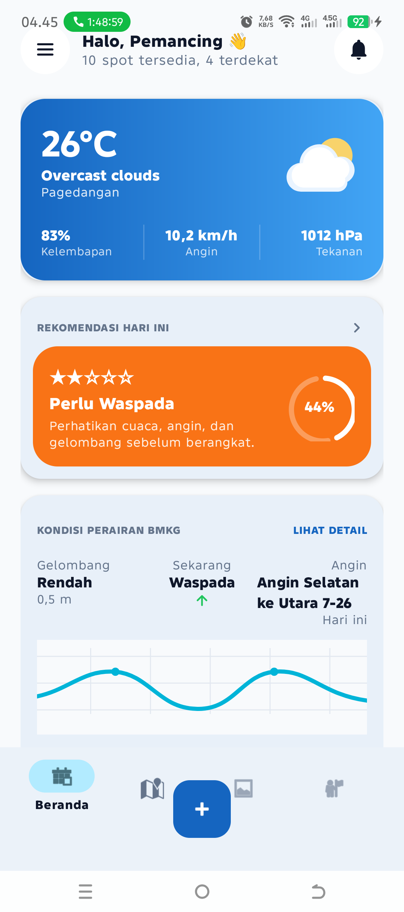
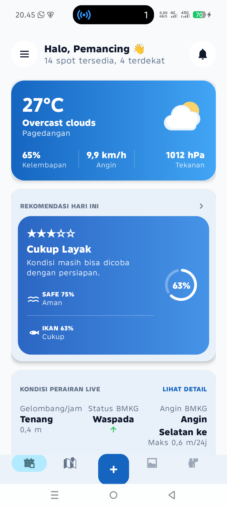
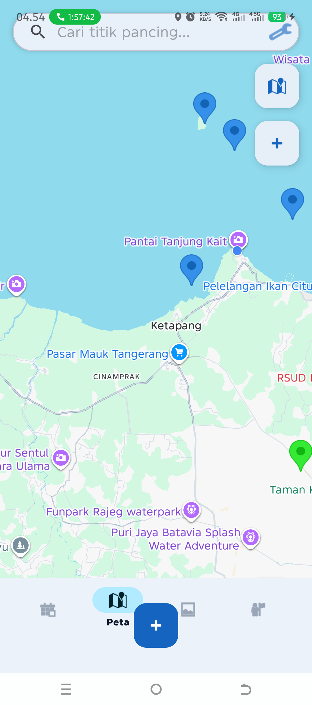
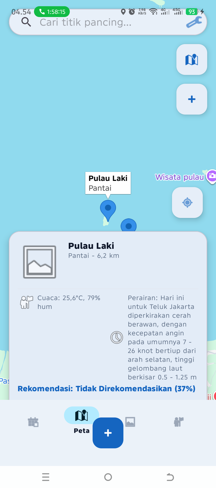
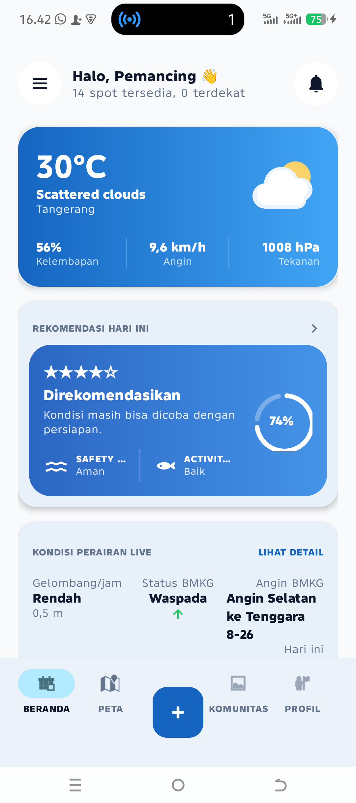
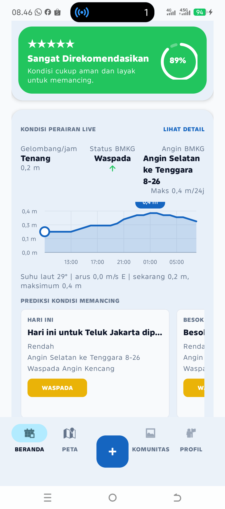
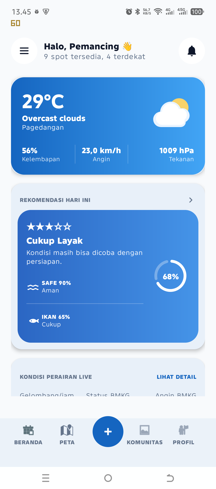
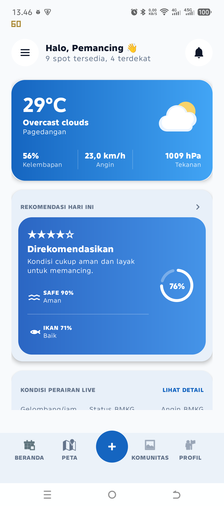

# BAB IV
# HASIL DAN PEMBAHASAN

## 4.4 Tahap Implementasi Sistem

Tahap implementasi merupakan proses penerjemahan hasil perancangan sistem ke dalam bentuk aplikasi Android yang dapat digunakan oleh pengguna. Aplikasi Fishing Point dikembangkan menggunakan Android Studio dengan bahasa pemrograman Java. Struktur kode dibuat secara terorganisasi agar mudah dikembangkan dan diuji, dengan pemisahan tanggung jawab ke dalam beberapa lapisan, yaitu `core`, `data`, `domain`, dan `presentation`.

Lapisan `core` digunakan untuk menyimpan utilitas umum, konfigurasi jaringan, pengelolaan session, serta fungsi pendukung aplikasi. Lapisan `data` berisi model data dan repository yang bertugas mengelola komunikasi dengan Firebase Firestore, OpenWeather, Open-Meteo Marine, BMKG, dan Cloudinary. Lapisan `domain` berisi model bisnis dan logika utama, termasuk perhitungan rekomendasi memancing. Sementara itu, lapisan `presentation` berisi Activity, Fragment, Adapter, dan ViewModel yang berhubungan langsung dengan tampilan dan interaksi pengguna.

Pembagian struktur tersebut bertujuan agar aplikasi tidak hanya dapat berjalan sesuai kebutuhan, tetapi juga lebih mudah dipelihara. Dengan pendekatan ini, setiap fitur memiliki ruang tanggung jawab yang lebih jelas, sehingga perubahan pada salah satu bagian tidak langsung mengganggu keseluruhan sistem.

### 4.4.1 Implementasi Authentication

Fitur authentication digunakan sebagai pintu masuk pengguna sebelum mengakses fitur utama aplikasi. Implementasi authentication dilakukan melalui halaman login, register, splash screen, reset password, dan logout. Proses login dan register memanfaatkan Firebase Authentication sebagai layanan autentikasi utama.

Pada saat pengguna membuka aplikasi, `SplashActivity` melakukan pemeriksaan awal terhadap status session. Jika pengguna sudah pernah login dan session masih valid, aplikasi akan langsung mengarahkan pengguna ke halaman utama. Sebaliknya, jika session tidak ditemukan, pengguna diarahkan ke halaman login. Mekanisme ini membuat pengalaman penggunaan menjadi lebih efisien karena pengguna tidak perlu melakukan login berulang kali.

Fitur register digunakan untuk membuat akun baru menggunakan email dan password. Data akun yang berhasil dibuat kemudian dapat dikaitkan dengan data pengguna pada Firestore. Fitur reset password menggunakan layanan bawaan Firebase Authentication, yaitu pengiriman tautan reset password ke alamat email yang terdaftar. Pada implementasi aplikasi, pengguna juga diberi informasi bahwa email reset dapat masuk ke folder spam agar pengguna tidak menganggap proses reset gagal.

Secara umum, modul authentication terdiri dari beberapa komponen utama, yaitu `LoginActivity`, `RegisterActivity`, `SplashActivity`, `AuthRepository`, serta ViewModel yang mengatur alur data dari tampilan menuju repository. Dengan adanya fitur ini, aplikasi dapat membedakan data antar pengguna, terutama pada fitur profile, community, favorite, dan pengelolaan spot.

### 4.4.2 Implementasi Dashboard

Dashboard merupakan halaman utama yang menampilkan ringkasan kondisi memancing kepada pengguna. Halaman ini dirancang sebagai pusat informasi karena pengguna dapat langsung melihat cuaca, kondisi perairan, rekomendasi memancing, tingkat keamanan, aktivitas ikan, dan daftar spot terdekat.

Implementasi dashboard dilakukan melalui `HomeFragment` dan `HomeViewModel`. `HomeViewModel` bertugas mengambil data lokasi pengguna, data cuaca, data perairan, data fishing point, serta menghitung rekomendasi melalui `RecommendationEngine`. Data yang telah diproses kemudian ditampilkan pada `HomeFragment` dalam bentuk card informasi yang ringkas dan mudah dipahami.

Data cuaca diperoleh dari OpenWeather API berdasarkan koordinat pengguna. Informasi yang digunakan meliputi kondisi langit, suhu, tekanan udara, kecepatan angin, dan jarak pandang. Untuk kondisi perairan, aplikasi menggunakan Open-Meteo Marine API guna memperoleh data gelombang per jam, tinggi gelombang saat ini, tinggi gelombang maksimum dalam 24 jam, suhu permukaan laut, dan arus laut. Data BMKG tetap digunakan sebagai informasi prakiraan resmi dan peringatan kondisi perairan, terutama untuk kebutuhan forecast dan konteks keselamatan.

Selain menampilkan informasi lingkungan, dashboard juga menampilkan spot terdekat. Daftar spot tersebut dihitung berdasarkan posisi pengguna menggunakan metode Haversine. Pada bagian ini, aplikasi tidak langsung menghitung rekomendasi berat untuk seluruh spot dalam jumlah besar. Pendekatan ini dilakukan agar dashboard tetap ringan dan responsif ketika digunakan pada perangkat Android nyata.



**Gambar 4.1 Tampilan dashboard aplikasi Fishing Point pada perangkat Android nyata**

Gambar 4.1 menunjukkan tampilan dashboard setelah proses penyesuaian UI/UX. Informasi utama seperti cuaca, kondisi perairan, rekomendasi memancing, tingkat keamanan, aktivitas ikan, dan daftar spot terdekat disusun dalam bentuk ringkasan agar mudah dibaca oleh pengguna.



**Gambar 4.2 Tampilan dashboard dengan informasi perairan dan rekomendasi live**

Gambar 4.2 memperlihatkan integrasi data lingkungan pada dashboard. Data cuaca, gelombang, safety score, dan fish activity ditampilkan sebagai informasi pendukung sebelum pengguna memilih spot memancing.

### 4.4.3 Implementasi Maps

Fitur maps merupakan salah satu fitur utama dalam aplikasi Fishing Point. Fitur ini diimplementasikan menggunakan Google Maps SDK melalui `MapFragment` dan `MapViewModel`. Peta digunakan untuk menampilkan posisi pengguna, marker fishing point, radius lokasi, serta jalur dari posisi pengguna menuju spot tujuan.

Marker pada peta merepresentasikan titik pancing yang tersimpan pada Firestore. Setiap marker dapat menampilkan informasi singkat mengenai spot, seperti nama lokasi, jenis spot, jarak dari pengguna, dan status akses spot. Aplikasi mendukung dua jenis akses spot, yaitu spot publik dan spot pribadi. Spot publik dapat dilihat oleh pengguna lain, sedangkan spot pribadi hanya dapat dilihat oleh pemiliknya.

Fitur tambah spot memungkinkan pengguna membuat titik pancing baru. Pada tahap implementasi, pengguna dapat menentukan apakah spot tersebut bersifat publik atau pribadi. Pemilik spot juga dapat mengubah status akses tersebut pada proses edit. Untuk menjaga keamanan data, tombol edit dan hapus hanya ditampilkan kepada pemilik spot. Dengan demikian, pengguna lain tidak dapat mengubah atau menghapus spot yang bukan miliknya.

Selain navigasi menggunakan Google Maps, aplikasi juga menyediakan polyline sebagai garis bantu dari posisi pengguna menuju spot. Fitur ini penting karena pada beberapa wilayah perairan, layanan rute Google Maps tidak selalu dapat menampilkan jalur secara lengkap. Polyline tidak menggantikan navigasi Google Maps, tetapi menjadi alternatif visual agar pengguna tetap mengetahui arah menuju spot.


**Gambar 4.3 Tampilan Google Maps dengan marker fishing point**

Gambar 4.3 menunjukkan tampilan peta yang digunakan untuk menampilkan posisi pengguna dan titik pancing. Marker digunakan sebagai representasi lokasi fishing point yang tersimpan pada Firestore.



**Gambar 4.4 Tampilan informasi spot pada halaman maps**

Gambar 4.4 menampilkan informasi ringkas pada spot yang dipilih. Informasi tersebut membantu pengguna memahami lokasi, jarak, dan detail awal sebelum membuka halaman detail spot.

### 4.4.4 Implementasi Detail Spot

Halaman detail spot diimplementasikan melalui `DetailSpotActivity`. Halaman ini menampilkan informasi lebih lengkap mengenai spot yang dipilih pengguna, seperti nama spot, jenis spot, lokasi, koordinat, status favorite, pemilik spot, foto spot, tombol share, tombol navigasi, serta data cuaca dan perairan berdasarkan koordinat spot tersebut.

Salah satu penyesuaian penting pada detail spot adalah penggunaan data lingkungan berdasarkan koordinat spot, bukan hanya lokasi pengguna saat ini. Dengan cara ini, kondisi cuaca dan gelombang yang ditampilkan pada detail spot menjadi lebih relevan terhadap lokasi yang akan dituju. Hal ini penting karena kondisi perairan pada satu titik dapat berbeda dengan kondisi di titik lain, terutama pada wilayah pesisir.

Fitur favorite memungkinkan pengguna menyimpan spot tertentu agar mudah ditemukan kembali. Fitur share digunakan untuk membagikan informasi spot melalui aplikasi lain yang tersedia pada perangkat. Untuk pemilik spot, aplikasi menyediakan fitur edit, hapus, dan pengelolaan foto spot. Jika pengguna belum menambahkan foto, aplikasi akan menampilkan gambar default sesuai jenis spot. Apabila foto spot dihapus, sistem akan mengembalikannya ke gambar default agar tampilan tetap konsisten.



**Gambar 4.5 Tampilan validasi informasi detail spot**

Gambar 4.5 memperlihatkan hasil validasi tampilan informasi spot. Pada tahap implementasi, detail spot disesuaikan agar data lokasi, favorite, navigasi, dan informasi pemilik spot dapat ditampilkan secara lebih jelas.

### 4.4.5 Implementasi Metode Haversine

Metode Haversine digunakan untuk menghitung jarak antara dua titik berdasarkan koordinat latitude dan longitude. Pada aplikasi Fishing Point, metode ini digunakan untuk menghitung jarak antara posisi pengguna dan lokasi fishing point. Hasil perhitungan jarak digunakan pada dashboard, maps, detail spot, daftar spot memancing, dan Recommendation Engine.

Rumus Haversine digunakan karena mampu menghitung jarak antar dua koordinat dengan mempertimbangkan kelengkungan permukaan bumi. Secara matematis, perhitungan Haversine dapat dituliskan sebagai berikut.

```text
a = sin^2(delta_lat / 2) + cos(lat1) x cos(lat2) x sin^2(delta_lon / 2)
c = 2 x atan2(sqrt(a), sqrt(1 - a))
d = R x c
```

Keterangan:

```text
lat1, lon1 = koordinat titik pertama
lat2, lon2 = koordinat titik kedua
R          = jari-jari bumi, sekitar 6371 km
d          = jarak antar dua titik dalam kilometer
```

Pada aplikasi, rumus tersebut diimplementasikan dalam kelas `LocationUtils`. Nilai jarak yang dihasilkan kemudian digunakan untuk menentukan Distance Score. Semakin dekat jarak spot terhadap pengguna, semakin tinggi nilai Distance Score yang diperoleh. Namun, jarak bukan satu-satunya faktor penentu rekomendasi karena sistem juga mempertimbangkan cuaca, gelombang, keamanan, kualitas spot, preferensi pengguna, dan aktivitas ikan.

### 4.4.6 Implementasi Recommendation Engine

Recommendation Engine merupakan komponen utama yang digunakan untuk memberikan rekomendasi spot memancing. Engine ini diimplementasikan pada kelas `RecommendationEngine` yang berada pada lapisan `domain`. Penempatan pada lapisan domain dilakukan agar logika rekomendasi tidak bercampur langsung dengan tampilan aplikasi.

Secara umum, Recommendation Engine menggabungkan beberapa komponen penilaian, yaitu Distance Score, Weather Score, Marine Score, Fish Activity Score, Spot Quality Score, User Preference Score, dan Safety Multiplier. Skor dasar dihitung terlebih dahulu, kemudian hasilnya disesuaikan dengan faktor keamanan agar rekomendasi yang diberikan tidak hanya memperhatikan peluang memancing, tetapi juga mempertimbangkan keselamatan pengguna.

Formula skor dasar yang digunakan adalah sebagai berikut.

```text
Base Score = (0.20 x D) + (0.20 x W) + (0.25 x M) + (0.15 x A) + (0.10 x S) + (0.10 x U)
```

Keterangan:

```text
D = Distance Score
W = Weather Score
M = Marine Score
A = Fish Activity Score
S = Spot Quality Score
U = User Preference Score
```

Setelah skor dasar diperoleh, sistem menerapkan faktor keamanan dengan rumus berikut.

```text
Final Score = Base Score x Safety Factor
```

Hasil akhir kemudian dibatasi dengan distance score cap agar spot yang terlalu jauh tidak direkomendasikan secara berlebihan meskipun kondisi lingkungan sedang baik.

#### Distance Engine

Distance Engine menghitung nilai berdasarkan jarak antara pengguna dan spot. Jarak dihitung menggunakan metode Haversine. Semakin dekat spot dari posisi pengguna, maka nilai jarak semakin tinggi. Ketentuan penilaian jarak ditampilkan pada Tabel 4.1.

**Tabel 4.1 Penilaian Distance Score**

| No | Jarak Spot dari Pengguna | Distance Score |
|---:|---|---:|
| 1 | <= 2 km | 100 |
| 2 | > 2 km sampai <= 5 km | 90 |
| 3 | > 5 km sampai <= 10 km | 75 |
| 4 | > 10 km sampai <= 20 km | 60 |
| 5 | > 20 km sampai <= 50 km | 40 |
| 6 | > 50 km | 20 |

Selain itu, sistem menerapkan batas skor akhir berdasarkan jarak. Tujuannya adalah mencegah spot yang sangat jauh tetap mendapatkan rekomendasi tinggi hanya karena kondisi cuaca dan perairannya baik.

#### Weather Engine

Weather Engine menghitung kondisi cuaca berdasarkan data live dari OpenWeather. Parameter yang digunakan meliputi kondisi langit, deskripsi cuaca, kecepatan angin, dan jarak pandang. Kondisi cerah dan berawan memperoleh nilai lebih tinggi, sedangkan hujan lebat dan badai petir memperoleh nilai lebih rendah karena berpotensi menurunkan kenyamanan dan keamanan aktivitas memancing.

**Tabel 4.2 Penilaian Weather Score**

| No | Kondisi Cuaca | Weather Score Dasar |
|---:|---|---:|
| 1 | Clear | 100 |
| 2 | Clouds | 88 |
| 3 | Mist, Fog, Haze | 70 |
| 4 | Drizzle | 55 |
| 5 | Rain | 35 |
| 6 | Thunderstorm | 10 |

Nilai tersebut dapat berkurang apabila kecepatan angin lebih dari 20 km/jam atau 30 km/jam. Selain itu, deskripsi seperti hujan lebat, badai, atau petir juga menurunkan skor karena menunjukkan kondisi yang kurang ideal.

#### Marine Engine

Marine Engine menghitung kondisi perairan berdasarkan data Open-Meteo Marine. Data yang digunakan meliputi tinggi gelombang saat ini, tinggi gelombang maksimum 24 jam ke depan, stabilitas gelombang, dan kecepatan arus laut. Formula Marine Score adalah sebagai berikut.

```text
Marine Score = (0.40 x Current Wave) + (0.25 x Max Wave 24 Jam) + (0.20 x Wave Stability) + (0.15 x Current Velocity)
```

Penggunaan data marine per jam membuat aplikasi dapat menampilkan kondisi perairan yang lebih aktual. Hal ini menjadi salah satu pembeda penting dari rancangan awal karena aplikasi tidak hanya mengandalkan prakiraan umum, tetapi juga membaca data gelombang dan arus yang lebih spesifik.

#### Fish Activity Engine

Fish Activity Engine digunakan untuk memperkirakan tingkat aktivitas ikan. Engine ini dikembangkan berdasarkan konsep solunar, kondisi cuaca, tekanan udara, dan pergerakan air. Pada implementasi terbaru, BMKG tidak lagi digunakan sebagai parameter pembatas Fish Activity. BMKG tetap digunakan sebagai informasi prakiraan dan peringatan resmi, tetapi perhitungan aktivitas ikan menggunakan data yang bersifat live, kecuali nilai solunar yang digunakan sebagai skenario pengujian.

Formula Fish Activity Score adalah sebagai berikut.

```text
Fish Activity = (0.35 x S) + (0.15 x W) + (0.25 x P) + (0.25 x M) + Bonus - Penalti
```

Keterangan:

```text
S = Solunar Score
W = Weather Score khusus aktivitas ikan
P = Pressure Score
M = Water Movement Score
```

Bobot Solunar sebesar 35% digunakan karena waktu makan ikan masih menjadi faktor penting, tetapi tidak dijadikan satu-satunya penentu. Weather Score sebesar 15% digunakan untuk menggambarkan pengaruh kondisi langit terhadap kenyamanan ikan, terutama ikan predator visual. Pressure Score sebesar 25% digunakan karena tekanan udara dapat memengaruhi aktivitas ikan melalui perubahan kondisi lingkungan. Water Movement Score sebesar 25% digunakan karena pergerakan air, gelombang rendah, dan arus yang stabil dapat membawa oksigen serta makanan alami.

Pada engine ini terdapat bonus dan penalti tambahan. Bonus fajar atau senja sebesar 15 poin diberikan pada pukul 04.30-06.00 dan 17.00-18.30 karena rentang tersebut dianggap sebagai waktu aktif ikan mencari makan. Bonus kondisi stabil sebesar 10 poin diberikan ketika cuaca dan kondisi laut berada pada rentang yang baik. Penalti angin dihitung berdasarkan data live OpenWeather, yaitu 15-25 km/jam dikurangi 10 poin, 26-35 km/jam dikurangi 20 poin, dan lebih dari 35 km/jam dikurangi 40 poin. Penalti malam sebesar 15 poin diterapkan untuk menyesuaikan aktivitas ikan yang lebih dominan aktif pada cahaya rendah pagi atau sore.

Untuk memastikan formula berjalan sesuai skenario, dilakukan unit testing terhadap tiga skenario Solunar dengan data lingkungan yang sama. Data uji yang digunakan adalah cuaca scattered clouds, tekanan 1008 hPa, angin live 24,2 km/jam, gelombang 0,6 m, arus laut 0,9 m/s, dan suhu laut 29 derajat Celsius. Hasil pengujian ditampilkan pada Tabel 4.3.

**Tabel 4.3 Hasil Simulasi Fish Activity Engine**

| No | Skenario | Solunar Score | Data Lingkungan | Hasil Fish Activity |
|---:|---|---:|---|---:|
| 1 | Di luar jam makan utama | 20 | Scattered clouds, 1008 hPa, angin 24,2 km/jam, gelombang 0,6 m, arus 0,9 m/s | 51,45% |
| 2 | Periode minor | 60 | Scattered clouds, 1008 hPa, angin 24,2 km/jam, gelombang 0,6 m, arus 0,9 m/s | 65,45% |
| 3 | Periode mayor | 90 | Scattered clouds, 1008 hPa, angin 24,2 km/jam, gelombang 0,6 m, arus 0,9 m/s | 75,95% |

Hasil tersebut menunjukkan bahwa semakin tinggi nilai solunar, semakin tinggi pula nilai aktivitas ikan. Perbedaan nilai dengan simulasi manual dapat terjadi karena engine aplikasi membaca skor internal yang lebih rinci, seperti tekanan 1008 hPa yang dianggap sangat baik, kondisi arus dan gelombang yang berada pada rentang ideal, serta penerapan penalti waktu malam ketika pengujian dijalankan. Dengan demikian, hasil pengujian tetap menunjukkan pola yang sesuai dengan konsep formula.

#### Spot Quality Engine

Spot Quality Engine menghitung kualitas spot berdasarkan rating yang diberikan pengguna. Rating yang lebih tinggi menunjukkan bahwa spot tersebut memiliki reputasi lebih baik. Nilai rating kemudian dikonversi menjadi skor internal agar dapat digabungkan dengan komponen lain dalam Recommendation Engine.

**Tabel 4.4 Penilaian Spot Quality Score**

| No | Rating Spot | Spot Quality Score |
|---:|---|---:|
| 1 | >= 4,5 | 90 |
| 2 | >= 4,0 | 80 |
| 3 | >= 3,5 | 70 |
| 4 | >= 3,0 | 60 |
| 5 | < 3,0 | 45 |

#### User Preference Engine

User Preference Engine digunakan untuk merepresentasikan kecenderungan pengguna terhadap spot tertentu. Nilai ini dapat berasal dari perilaku pengguna, seperti favorite atau interaksi dengan spot. Pada implementasi saat ini, nilai preferensi dibatasi pada rentang 0 sampai 100 agar tidak menghasilkan skor yang terlalu tinggi atau terlalu rendah secara tidak wajar.

#### Safety Engine

Safety Engine menghasilkan Safety Multiplier yang digunakan untuk mengoreksi skor akhir rekomendasi. Komponen ini penting karena kondisi yang baik untuk aktivitas ikan belum tentu aman bagi pengguna. Oleh karena itu, aplikasi membedakan antara peluang memancing dan tingkat keamanan.

Parameter yang digunakan pada Safety Engine meliputi cuaca buruk, kecepatan angin, tinggi gelombang, kecepatan arus, serta peringatan BMKG. Berbeda dengan Fish Activity Engine yang tidak lagi menggunakan BMKG sebagai pembatas, Safety Engine tetap mempertimbangkan BMKG sebagai lapisan peringatan resmi. Hal ini dilakukan karena aspek keselamatan perlu lebih konservatif dibandingkan aspek aktivitas ikan.

Penilaian kecepatan angin pada Safety Engine diadaptasi dari Skala Beaufort dan disesuaikan dengan kondisi perairan pesisir Indonesia, khususnya wilayah penelitian. Tabel 4.5 menunjukkan klasifikasi penilaian angin yang digunakan.

**Tabel 4.5 Penilaian Keamanan Angin pada Safety Engine**

| No | Kecepatan Angin | Kategori | Nilai Safety |
|---:|---|---|---:|
| 1 | <= 8 km/jam | Tenang sampai sepoi ringan | 1,00 |
| 2 | 9-14 km/jam | Sepoi lembut | 0,95 |
| 3 | 15-19 km/jam | Cukup aman | 0,85 |
| 4 | 20-28 km/jam | Waspada | 0,70 |
| 5 | 29-38 km/jam | Berisiko untuk perahu kecil | 0,55 |
| 6 | 39-49 km/jam | Sangat berisiko | 0,40 |
| 7 | > 49 km/jam | Tidak disarankan | 0,25 |

Selain angin, Safety Engine juga menghitung Wave Safety. Gelombang di bawah atau sama dengan 0,5 meter dianggap sangat aman, gelombang sampai 1,25 meter masih cukup aman, sedangkan gelombang yang lebih tinggi akan menurunkan nilai keamanan. Kecepatan arus juga diperhitungkan karena arus yang terlalu kuat dapat menyulitkan aktivitas memancing dan berpotensi membahayakan pengguna.

Nilai Safety Multiplier akhir diambil dari kondisi terendah di antara faktor cuaca, angin, gelombang, dan arus. Setelah itu, sistem memberikan penyesuaian tambahan berdasarkan peringatan BMKG. Pendekatan ini membuat engine tidak hanya mengejar skor rekomendasi tinggi, tetapi tetap memperhatikan aspek keamanan lapangan.

#### Final Recommendation

Final Recommendation diperoleh dari skor dasar yang dikoreksi menggunakan Safety Multiplier. Hasil akhir kemudian dikonversi menjadi label yang mudah dipahami pengguna. Kategori rekomendasi yang digunakan ditampilkan pada Tabel 4.6.

**Tabel 4.6 Kategori Final Recommendation**

| No | Rentang Skor | Label Rekomendasi |
|---:|---|---|
| 1 | >= 85 | Sangat Direkomendasikan |
| 2 | >= 70 sampai < 85 | Direkomendasikan |
| 3 | >= 55 sampai < 70 | Cukup Layak |
| 4 | >= 40 sampai < 55 | Perlu Waspada |
| 5 | < 40 | Tidak Direkomendasikan |

Dengan mekanisme ini, rekomendasi yang ditampilkan aplikasi tidak hanya berdasarkan jarak terdekat, tetapi juga mempertimbangkan kondisi lingkungan yang sedang terjadi.



**Gambar 4.6 Tampilan rekomendasi, safety, fish activity, dan kondisi gelombang**

Gambar 4.6 menunjukkan tampilan ringkasan rekomendasi pada dashboard. Informasi safety dan fish activity digunakan sebagai indikator pendukung agar pengguna dapat memahami kondisi sebelum memancing.

### 4.4.7 Implementasi Community

Modul Community dikembangkan sebagai media berbagi pengalaman antar pengguna. Fitur ini diimplementasikan melalui `CommunityFragment`, `CreatePostFragment`, `CommunityViewModel`, `PostAdapter`, dan `CommunityRepository`. Pengguna dapat membuat postingan dengan foto, deskripsi, jenis ikan secara opsional, dan lokasi secara opsional.

Pada tahap pengembangan, beberapa field yang dianggap terlalu berlebihan disederhanakan. Field seperti berat ikan dan umpan tidak lagi menjadi isian utama agar proses membuat postingan lebih mudah digunakan. Penyederhanaan ini dilakukan karena target pengguna aplikasi tidak selalu terbiasa mengisi data teknis yang terlalu banyak.

Foto postingan diunggah melalui Cloudinary. Setelah proses upload berhasil, URL gambar disimpan ke Firestore bersama data postingan. Fitur interaksi yang tersedia pada Community meliputi like, unlike, komentar, favorite atau bookmark, share, dan hapus postingan oleh pemiliknya. Dengan fitur ini, aplikasi tidak hanya berfungsi sebagai pencari spot, tetapi juga sebagai media dokumentasi dan pertukaran informasi antar pemancing.



**Gambar 4.7 Tampilan halaman community**

Gambar 4.7 menunjukkan halaman community yang digunakan untuk menampilkan postingan pengguna. Fitur ini mendukung interaksi pengguna melalui postingan, foto, komentar, like, favorite, dan share.

### 4.4.8 Implementasi Profile

Modul Profile berfungsi sebagai halaman pengelolaan identitas dan aktivitas pengguna. Fitur ini diimplementasikan melalui `ProfileFragment`, `ProfileViewModel`, dan `ProfileRepository`. Informasi yang ditampilkan meliputi nama pengguna, email, foto profil, statistik postingan, jumlah spot yang dibuat, serta jumlah spot favorit.

Pengguna dapat memperbarui data profil dan mengganti foto profil. Foto profil diunggah melalui Cloudinary, sedangkan URL hasil upload disimpan pada Firestore. Selain itu, halaman profile menyediakan daftar spot saya, daftar spot favorit, dan daftar postingan saya. Fitur ini membantu pengguna melihat kembali data yang pernah dibuat atau disimpan.

Fitur reset password juga tersedia pada halaman profile. Ketika pengguna meminta reset password, Firebase Authentication akan mengirimkan email reset ke alamat pengguna. Aplikasi memberikan informasi tambahan bahwa email reset dapat masuk ke folder spam, sehingga pengguna dapat memeriksa folder tersebut apabila email tidak muncul pada kotak masuk utama.


**Gambar 4.8 Tampilan halaman profile**

Gambar 4.8 menunjukkan halaman profile yang berisi informasi pengguna, statistik aktivitas, daftar spot, spot favorit, postingan pengguna, reset password, dan logout.

### 4.4.9 Implementasi Firestore

Cloud Firestore digunakan sebagai basis data utama aplikasi. Firestore dipilih karena mendukung penyimpanan data berbasis dokumen, sinkronisasi realtime, dan integrasi yang baik dengan Firebase Authentication. Data yang disimpan meliputi data pengguna, fishing spot, favorite, postingan komunitas, komentar, review, notifikasi, cache cuaca, dan cache kondisi perairan.

Pengelolaan Firestore dilakukan melalui beberapa repository, seperti `AuthRepository`, `FishingRepository`, `CommunityRepository`, `ProfileRepository`, `FavoriteRepository`, `ReviewRepository`, `NotificationRepository`, `WeatherRepository`, `TideRepository`, dan `MarineHourlyRepository`. Setiap repository memiliki tanggung jawab sesuai jenis data yang dikelola.

Penggunaan repository membuat kode lebih terstruktur karena Activity atau Fragment tidak langsung berkomunikasi dengan Firestore. Tampilan cukup berkomunikasi dengan ViewModel, kemudian ViewModel memanggil repository untuk mengambil atau menyimpan data. Pendekatan ini mendukung konsep pemisahan tanggung jawab dan memudahkan proses pengujian.

### 4.4.10 Implementasi Cloudinary

Cloudinary digunakan sebagai layanan penyimpanan media pada aplikasi Fishing Point. Pemilihan Cloudinary dilakukan karena aplikasi menggunakan Firestore sebagai basis data, sedangkan media seperti foto profil, foto spot, dan foto postingan membutuhkan layanan penyimpanan file tersendiri.

Proses upload dilakukan dengan mengirimkan file gambar ke Cloudinary menggunakan upload preset yang telah disiapkan. Setelah upload berhasil, Cloudinary mengembalikan URL gambar yang kemudian disimpan pada dokumen Firestore. Dengan cara ini, Firestore hanya menyimpan data teks dan URL, sedangkan file media dikelola oleh Cloudinary.

Implementasi Cloudinary digunakan pada tiga bagian utama, yaitu profile, community, dan detail spot. Pada profile, Cloudinary menyimpan foto pengguna. Pada community, Cloudinary menyimpan foto postingan. Pada detail spot, Cloudinary menyimpan foto khusus spot yang dapat diubah oleh pemilik spot.

## 4.5 Tahap Pengujian Sistem

Tahap pengujian dilakukan untuk memastikan bahwa aplikasi dapat berjalan sesuai kebutuhan yang telah ditentukan. Pengujian dilakukan menggunakan pendekatan black box testing, unit testing, dan pengujian langsung pada perangkat Android nyata. Pengujian ini berfokus pada fungsi utama aplikasi, stabilitas alur pengguna, dan ketepatan hasil perhitungan pada fitur yang bersifat algoritmik.

### 4.5.1 Black Box Testing

Black box testing dilakukan dengan menguji aplikasi dari sisi pengguna tanpa melihat kode program secara langsung. Pengujian dilakukan terhadap fitur login, register, dashboard, maps, detail spot, community, profile, favorite, reset password, dan logout.

**Tabel 4.7 Black Box Testing**

| No | Modul | Skenario Pengujian | Hasil yang Diharapkan | Status |
|---:|---|---|---|---|
| 1 | Login | Pengguna memasukkan email dan password valid | Pengguna masuk ke halaman utama | Berhasil |
| 2 | Register | Pengguna membuat akun baru | Akun tersimpan dan dapat digunakan login | Berhasil |
| 3 | Reset Password | Pengguna meminta reset password | Email reset dikirim oleh Firebase | Berhasil |
| 4 | Dashboard | Pengguna membuka halaman utama | Cuaca, perairan, rekomendasi, safety, dan aktivitas ikan tampil | Berhasil |
| 5 | Maps | Pengguna membuka halaman peta | Marker spot dan posisi pengguna tampil | Berhasil |
| 6 | Tambah Spot | Pengguna menambah spot publik atau pribadi | Spot tersimpan sesuai status akses | Berhasil |
| 7 | Detail Spot | Pengguna membuka detail spot | Informasi spot, cuaca, perairan, favorite, dan navigasi tampil | Berhasil |
| 8 | Community | Pengguna membuat postingan dengan foto | Postingan tersimpan dan muncul pada feed | Berhasil |
| 9 | Profile | Pengguna mengubah foto profil | Foto profil diperbarui melalui Cloudinary | Berhasil |
| 10 | Favorite | Pengguna menyimpan spot favorit | Spot muncul pada daftar favorit | Berhasil |

### 4.5.2 Unit Testing

Unit testing dilakukan pada bagian kode yang memiliki logika perhitungan atau fungsi mandiri. Pengujian utama dilakukan pada metode Haversine dan Recommendation Engine. Pengujian Haversine memastikan bahwa perhitungan jarak antar koordinat menghasilkan nilai yang masuk akal. Pengujian Recommendation Engine memastikan bahwa skor rekomendasi tetap berada pada rentang 0 sampai 100, cuaca buruk menghasilkan nilai lebih rendah daripada cuaca baik, dan Fish Activity meningkat sesuai kenaikan nilai solunar.

Pada pengujian Fish Activity, dilakukan tiga skenario dengan data lingkungan yang sama dan nilai solunar yang berbeda. Hasil pengujian menunjukkan bahwa nilai aktivitas ikan meningkat dari skenario rendah ke skenario tinggi. Hal ini membuktikan bahwa engine telah merespons perubahan solunar sesuai formula yang dirancang.

### 4.5.3 Pengujian Device Nyata

Pengujian juga dilakukan pada perangkat Android nyata untuk memastikan aplikasi tidak hanya berjalan pada emulator atau proses build, tetapi juga dapat digunakan pada perangkat fisik. Pengujian pada perangkat nyata penting karena fitur seperti GPS, kamera atau galeri, koneksi internet, Google Maps, dan interaksi UI lebih akurat diuji langsung pada smartphone.

Pada pengujian perangkat nyata, aplikasi berhasil dipasang dan dijalankan. Beberapa bagian yang sebelumnya mengalami kendala, seperti tampilan dashboard yang terpotong, bottom navigation yang tidak proporsional, detail spot yang tertindih, serta force close pada beberapa alur, telah diperbaiki. Pengujian juga dilakukan terhadap alur utama seperti login, membuka dashboard, membuka maps, membuka detail spot, membuat postingan, mengubah profil, dan melihat daftar spot.



**Gambar 4.9 Pengujian runtime pada halaman dashboard**

Gambar 4.9 menunjukkan hasil pengujian runtime pada perangkat nyata. Pengujian ini dilakukan untuk memastikan bahwa tampilan utama dapat berjalan tanpa crash dan informasi utama dapat terbaca.



**Gambar 4.10 Pengujian runtime pada halaman maps**

Gambar 4.10 menunjukkan pengujian halaman maps pada perangkat nyata. Pengujian ini berfokus pada tampilan peta, marker, dan perpindahan halaman yang menjadi bagian penting dari aplikasi berbasis lokasi.

### 4.5.4 Hasil Pengujian

Berdasarkan hasil pengujian, fitur utama aplikasi telah berjalan sesuai tujuan. Aplikasi mampu membaca lokasi pengguna, menampilkan data cuaca dan perairan, menghitung jarak menggunakan Haversine, memberikan rekomendasi memancing, menampilkan marker spot pada peta, serta mendukung fitur community dan profile. Hasil unit testing dan build juga menunjukkan bahwa perubahan pada engine tidak menyebabkan error kompilasi.

**Tabel 4.8 Ringkasan Hasil Pengujian Sistem**

| No | Komponen | Jenis Pengujian | Hasil |
|---:|---|---|---|
| 1 | LocationUtils Haversine | Unit Testing | Berhasil |
| 2 | Recommendation Engine | Unit Testing | Berhasil |
| 3 | Fish Activity Scenario | Unit Testing | Berhasil |
| 4 | Authentication | Black Box Testing | Berhasil |
| 5 | Dashboard | Black Box Testing dan Device Test | Berhasil |
| 6 | Maps | Black Box Testing dan Device Test | Berhasil |
| 7 | Community | Black Box Testing | Berhasil |
| 8 | Profile | Black Box Testing | Berhasil |
| 9 | Build Debug | Gradle Build | Berhasil |

## 4.6 Tahap Pemeliharaan Sistem

Tahap pemeliharaan dilakukan setelah aplikasi dapat berjalan untuk memperbaiki kekurangan yang ditemukan selama pengujian. Pada penelitian ini, pemeliharaan dilakukan secara bertahap berdasarkan hasil observasi, pengujian perangkat nyata, dan evaluasi kebutuhan pengguna.

Beberapa perbaikan yang dilakukan meliputi perbaikan tampilan dashboard agar tidak ada teks yang terpotong, penyesuaian ukuran bottom navigation, perbaikan card detail spot agar tidak tertindih, optimalisasi daftar spot agar tidak menghitung rekomendasi secara berat pada seluruh spot, serta penyempurnaan tampilan community agar gambar postingan tidak terpotong.

Pada modul maps, dilakukan perbaikan terhadap marker, polyline, akses edit dan hapus berdasarkan owner, serta pemisahan spot publik dan spot pribadi. Pada modul profile, dilakukan perbaikan daftar spot saya, spot favorit, postingan saya, dan reset password. Pada modul community, dilakukan penyederhanaan form upload agar lebih mudah digunakan.

Pemeliharaan juga dilakukan pada Recommendation Engine. Pada tahap awal, nilai safety dan aktivitas ikan beberapa kali dikalibrasi berdasarkan hasil observasi lapangan. Salah satu perbaikan penting adalah pemisahan penggunaan BMKG antara Safety Engine dan Fish Activity Engine. BMKG tetap digunakan sebagai lapisan peringatan keselamatan, sedangkan Fish Activity lebih difokuskan pada data live seperti cuaca, tekanan udara, angin live, gelombang, arus, dan suhu laut. Perubahan ini membuat skor aktivitas ikan lebih sesuai dengan kondisi lapangan yang diamati.

## 4.7 Pembahasan

Berdasarkan hasil implementasi, aplikasi Fishing Point telah memenuhi kebutuhan utama penelitian. Aplikasi mampu membantu pengguna menemukan lokasi fishing point, melihat posisi pengguna pada peta, menghitung jarak menuju spot, memperoleh informasi cuaca dan perairan, serta menerima rekomendasi memancing berdasarkan kondisi lingkungan.

Metode Haversine berhasil diterapkan untuk menghitung jarak antara pengguna dan fishing point. Hasil perhitungan jarak tersebut digunakan secara konsisten pada dashboard, maps, detail spot, dan Recommendation Engine. Dengan demikian, pengguna dapat mengetahui spot terdekat secara lebih objektif berdasarkan koordinat GPS.

Integrasi Google Maps berjalan sebagai media visualisasi lokasi. Marker fishing point dapat ditampilkan pada peta, sedangkan fitur polyline membantu pengguna memahami arah menuju spot ketika rute Google Maps tidak tersedia di wilayah perairan. Fitur ini sesuai dengan karakteristik aplikasi yang berfokus pada lokasi pesisir dan perairan.

Recommendation Engine menjadi bagian penting karena aplikasi tidak hanya menampilkan titik pancing, tetapi juga memberikan penilaian berdasarkan beberapa faktor. Penggabungan jarak, cuaca, kondisi laut, aktivitas ikan, kualitas spot, preferensi pengguna, dan keselamatan membuat rekomendasi yang diberikan lebih kontekstual. Hasil kalibrasi engine menunjukkan bahwa kondisi lapangan perlu diperhatikan, terutama pada kecepatan angin dan peringatan perairan.

Penggunaan OpenWeather dan Open-Meteo Marine memberikan data live yang membantu aplikasi menampilkan kondisi saat ini. BMKG tetap berperan sebagai sumber prakiraan resmi dan peringatan keselamatan. Pemisahan fungsi data ini membuat aplikasi lebih seimbang: data live digunakan untuk membaca kondisi aktual, sedangkan BMKG digunakan sebagai rujukan forecast dan kewaspadaan.

Fitur community dan profile melengkapi fungsi aplikasi. Community memungkinkan pengguna membagikan pengalaman dan hasil tangkapan, sedangkan profile membantu pengguna mengelola data pribadi, foto, spot, favorit, dan postingan. Dengan adanya fitur publik dan pribadi pada spot, pengguna dapat memilih apakah lokasi pancing ingin dibagikan kepada pengguna lain atau hanya disimpan untuk dirinya sendiri.

Secara keseluruhan, hasil pengembangan menunjukkan bahwa aplikasi Fishing Point dapat digunakan sebagai alat bantu pemancing dalam menentukan spot memancing. Aplikasi tidak menggantikan pertimbangan langsung di lapangan, tetapi dapat memberikan informasi awal yang lebih terstruktur sehingga pengguna dapat mengambil keputusan dengan lebih baik.

## 4.8 Kesimpulan BAB IV

Berdasarkan hasil implementasi dan pengujian yang telah dilakukan, aplikasi Fishing Point berhasil dikembangkan sesuai dengan rancangan sistem. Aplikasi mampu menyediakan fitur authentication, dashboard, maps, detail spot, recommendation engine, community, profile, Firestore, dan Cloudinary.

Metode Haversine berhasil digunakan untuk menghitung jarak antara pengguna dan fishing point. Recommendation Engine berhasil menggabungkan beberapa parameter, yaitu jarak, cuaca, kondisi perairan, aktivitas ikan, kualitas spot, preferensi pengguna, dan faktor keselamatan. Pengujian Fish Activity menunjukkan bahwa nilai aktivitas ikan meningkat seiring kenaikan nilai solunar pada kondisi lingkungan yang sama.

Pengujian pada perangkat nyata menunjukkan bahwa alur utama aplikasi dapat berjalan dengan baik. Beberapa perbaikan UI/UX, optimasi performa, dan kalibrasi engine telah dilakukan agar aplikasi lebih stabil, responsif, dan sesuai dengan kebutuhan penelitian. Dengan demikian, hasil pada BAB IV menunjukkan bahwa aplikasi telah siap digunakan sebagai dasar pembahasan akhir pada BAB V.
